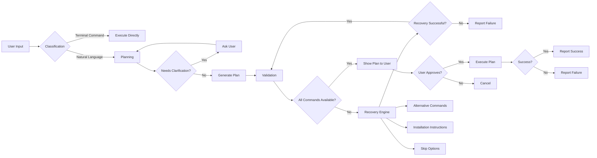
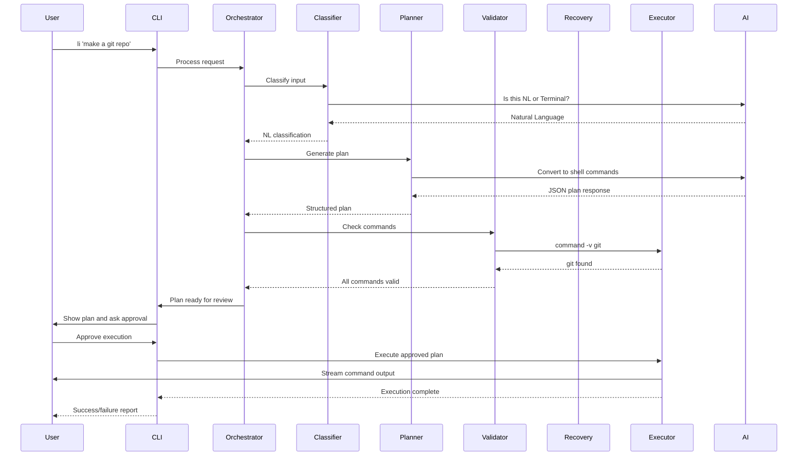
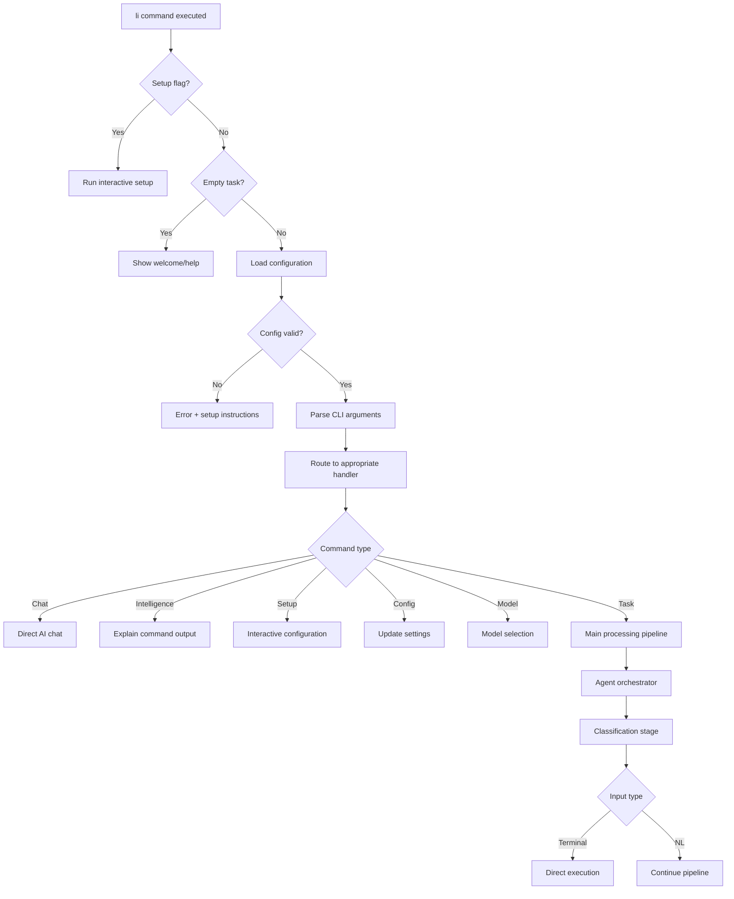
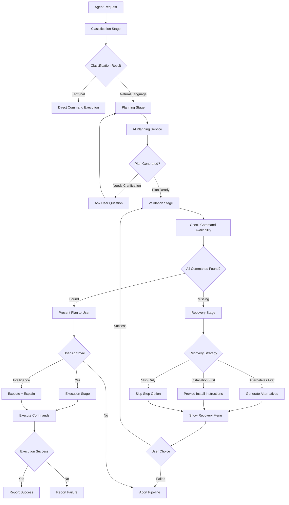

# li CLI Assistant - Architecture Overview

## Table of Contents
1. [Project Overview](#project-overview)
2. [Directory Structure](#directory-structure)
3. [File-by-File Analysis](#file-by-file-analysis)
4. [Architecture Overview](#architecture-overview-1)
5. [Program Flow](#program-flow)
6. [Key Subsystems](#key-subsystems)
7. [Where to Make Modifications](#where-to-make-modifications)
8. [Dependencies and External Libraries](#dependencies-and-external-libraries)

---

## Project Overview

**li** is a lightweight terminal assistant that converts natural language to shell commands. Built in Rust, it provides a safe, minimal command plan generation system that users can review and execute. The application runs on top of the existing shell rather than replacing it, focusing on safety through user approval of all generated plans.

### Key Features
- 🧠 **Natural Language to Commands**: Type plain English, get shell commands
- 🛡️ **Safe Execution**: Every plan is previewed before execution
- 🎯 **Smart Classification**: Automatically distinguishes between shell commands and natural language tasks
- 💬 **Direct AI Chat**: Use `--chat` flag for conversational AI assistance
- 🧠 **AI Intelligence Mode**: Use `-i` flag to explain command outputs in human-friendly terms
- 🌐 **Provider Choice**: Switch between OpenRouter and Cerebras with `li --provider`
- 🔧 **Interactive Setup**: Easy first-time configuration with `li --setup`
- 🪝 **Shell Hook Integration**: Optional zsh hook for seamless terminal experience

### Design Philosophy
- **Safety First**: Never auto-execute without explicit user action
- **User Control**: Users see exactly what will run before it runs
- **Minimal Dependencies**: Zero local AI requirements using hosted providers (OpenRouter, Cerebras)
- **Shell Integration**: Works with existing shell, doesn't replace it

---

## Directory Structure

```
li/
├── src/                          # Main source code directory
│   ├── main.rs                   # Application entry point
│   ├── cli/                      # Command-line interface handling
│   │   ├── mod.rs               # Module exports
│   │   └── runtime.rs           # CLI parsing and execution logic
│   ├── agent/                    # Core agent orchestration system
│   │   ├── mod.rs               # Module exports and types
│   │   ├── adapters.rs          # Adapter implementations for stages
│   │   ├── context.rs           # Shared execution context
│   │   ├── orchestrator.rs      # Pipeline orchestration
│   │   ├── outcome.rs           # Result types and handling
│   │   ├── stages.rs            # Stage definitions
│   │   └── types.rs             # Core type definitions
│   ├── classifier/               # Input classification logic
│   │   └── mod.rs               # Classification implementation
│   ├── planner/                  # Command planning logic
│   │   └── mod.rs               # Planning implementation
│   ├── validator/                # Command validation system
│   │   └── mod.rs               # Validation implementation
│   ├── exec/                     # Command execution engine
│   │   └── mod.rs               # Execution implementation
│   ├── recovery/                 # Error recovery system
│   │   ├── mod.rs               # Recovery implementation
│   │   └── tests.rs             # Recovery tests
│   ├── hook/                     # Shell integration hooks
│   │   └── mod.rs               # Hook implementation
│   ├── client.rs                 # HTTP client for AI services
│   ├── config.rs                 # Configuration management
│   └── tokens.rs                 # Token handling utilities
├── documentation/                # Documentation files
│   ├── architecture-overview.md  # This document
│   ├── prd.md                    # Product requirements document
│   ├── future_plans.md           # Future development plans
│   ├── example-config.json       # Example configuration
│   └── archive/                  # Historical documentation
├── resource/                     # Static resources
│   └── li_logo.png              # Application logo
├── .cursor/                     # IDE-specific configuration
│   └── rules/
│       └── general.md           # General rules
├── Cargo.toml                    # Rust project configuration
├── Cargo.lock                    # Dependency lock file
├── README.md                     # User documentation
└── Various setup/installation files
```

---

## File-by-File Analysis

### Core Entry Points

#### [`src/main.rs`](src/main.rs:1)
The application entry point that:
- Initializes the Tokio async runtime
- Parses CLI arguments using `clap`
- Handles special cases (setup, empty task, welcome message)
- Loads configuration or exits with setup instructions
- Delegates to the CLI runtime for actual execution

**Key responsibilities**: Bootstrap, configuration loading, error handling

#### [`src/cli/mod.rs`](src/cli/mod.rs:1)
Simple module export file that re-exports the main CLI structure.

#### [`src/cli/runtime.rs`](src/cli/runtime.rs:1)
The heart of the CLI system (1,236 lines) that:
- Defines all CLI commands and flags using `clap` derive macros
- Handles interactive setup flows
- Manages model selection and configuration
- Implements the main task execution pipeline
- Provides intelligent mode for explaining command outputs
- Handles direct chat functionality

**Key responsibilities**: CLI parsing, user interaction, orchestration

### Core Agent System

#### [`src/agent/mod.rs`](src/agent/mod.rs:1)
Central module that exports all agent components:
- Adapters for different pipeline stages
- Context and request handling
- Orchestrator and outcome types
- Stage definitions and execution

#### [`src/agent/orchestrator.rs`](src/agent/orchestrator.rs:1)
Pipeline orchestration system that:
- Manages the sequence of processing stages
- Provides a builder pattern for stage configuration
- Handles stage execution and error propagation
- Maintains execution context across stages

**Key responsibilities**: Pipeline management, stage coordination

#### [`src/agent/adapters.rs`](src/agent/adapters.rs:1)
Implementation of pipeline stage adapters:
- `DirectClassifierAdapter`: Handles input classification
- `DirectPlanningAdapter`: Manages command planning
- `CommandValidationAdapter`: Validates planned commands
- `PlanExecutionAdapter`: Executes approved plans
- Various noop adapters for testing and configuration

#### [`src/agent/context.rs`](src/agent/context.rs:1)
Shared execution context that tracks:
- Original agent request and configuration
- Generated plans and validation results
- Execution reports and recovery outcomes
- Event logging and timing information

#### [`src/agent/stages.rs`](src/agent/stages.rs:1)
Stage definitions for the processing pipeline:
- `ClassificationStage`: Determines input type
- `PlanningStage`: Generates command plans
- `ValidationStage`: Checks command availability
- `ExecutionStage`: Runs approved commands
- `RecoveryStage`: Handles missing tools/errors

### AI Service Integration

#### [`src/classifier/mod.rs`](src/classifier/mod.rs:1)
Input classification system that:
- Uses AI to distinguish natural language from shell commands
- Implements strict JSON parsing for reliable results
- Provides comprehensive testing with mocked responses
- Uses a detailed system prompt for consistent classification

**Key responsibilities**: Input analysis, command vs. NL detection

#### [`src/planner/mod.rs`](src/planner/mod.rs:1)
Command planning system that:
- Converts natural language into safe shell command sequences
- Supports interactive clarification when needed
- Handles AI model responses with robust JSON parsing
- Includes safety checks and confidence scoring

**Key responsibilities**: Command generation, safety validation, user interaction

#### [`src/client.rs`](src/client.rs:1)
HTTP client for AI services that:
- Implements the `LlmClient` trait for different providers
- Handles OpenRouter and Cerebras API interactions
- Manages authentication, timeouts, and error handling
- Provides factory methods for client creation

### System Integration

#### [`src/exec/mod.rs`](src/exec/mod.rs:1)
Command execution engine that:
- Executes shell commands with proper environment setup
- Streams output in real-time with visual formatting
- Captures output for intelligence mode analysis
- Handles color output and terminal integration

#### [`src/validator/mod.rs`](src/validator/mod.rs:1)
Command validation system that:
- Checks if planned commands exist on the system
- Maintains a cache of validated commands
- Handles complex command parsing (pipes, redirects, etc.)
- Provides detailed missing command information

#### [`src/recovery/mod.rs`](src/recovery/mod.rs:1)
Error recovery system that:
- Generates alternative commands when tools are missing
- Provides installation instructions for missing dependencies
- Offers interactive recovery menus
- Supports multiple recovery strategies (alternatives first, installation first)

#### [`src/hook/mod.rs`](src/hook/mod.rs:1)
Shell integration system that:
- Installs zsh hooks for seamless integration
- Handles shell command interception
- Provides install/uninstall functionality

### Configuration & Utilities

#### [`src/config.rs`](src/config.rs:1)
Configuration management that:
- Handles multiple configuration formats (legacy and nested)
- Provides environment variable overrides
- Manages model settings, API keys, and preferences
- Includes comprehensive validation and defaults

#### [`src/tokens.rs`](src/tokens.rs:1)
Token handling utilities for:
- Calculating token budgets for AI requests
- Managing context window limits
- Optimizing API usage

---

## Architecture Overview

### System Architecture Diagram

```mermaid
graph TB
    subgraph "User Interface Layer"
        CLI[CLI Interface]
        Hook[Shell Hook]
        Setup[Interactive Setup]
    end
    
    subgraph "Orchestration Layer"
        Orch[Agent Orchestrator]
        Context[Agent Context]
        Stages[Pipeline Stages]
    end
    
    subgraph "Processing Layer"
        Class[Classifier]
        Plan[Planner]
        Valid[Validator]
        Exec[Executor]
        Recover[Recovery Engine]
    end
    
    subgraph "Service Layer"
        LLM[AI Client]
        Config[Configuration]
        Shell[Command Shell]
    end
    
    subgraph "External Services"
        ProviderAPI[LLM Provider API (OpenRouter/Cerebras)]
        FileSystem[Local File System]
    end
    
    CLI --> Orch
    Hook --> Class
    Setup --> Config
    
    Orch --> Stages
    Orch --> Context
    
    Stages --> Class
    Stages --> Plan
    Stages --> Valid
    Stages --> Exec
    Stages --> Recover
    
    Class --> LLM
    Plan --> LLM
    Valid --> Shell
    Exec --> Shell
    Recover --> LLM
    Recover --> Shell
    
    LLM --> ProviderAPI
    Config --> FileSystem
    Exec --> FileSystem
```

### Data Flow Diagram



### Component Interaction Diagram



---

## Program Flow

### Startup Flow



### Main Processing Pipeline



---

## Key Subsystems

### 1. CLI Subsystem

**Location**: [`src/cli/runtime.rs`](src/cli/runtime.rs:1)

**Purpose**: Handles all user-facing command-line interactions, argument parsing, and user experience flows.

**Key Components**:
- **CLI Parser**: Uses `clap` derive macros for comprehensive argument handling
- **Setup Flow**: Interactive configuration wizard for first-time users
- **Model Selection**: Dynamic model fetching when using OpenRouter
- **Provider Selection**: Interactive switching between OpenRouter and Cerebras
- **Intelligence Mode**: Command output explanation with AI analysis
- **Direct Chat**: Bypass planning for direct AI conversation

**Key Functions**:
- [`Cli::run()`](src/cli/runtime.rs:212): Main execution dispatcher
- [`handle_setup()`](src/cli/runtime.rs:846): Interactive configuration
- [`handle_chat_direct()`](src/cli/runtime.rs:1001): Direct AI conversation
- [`handle_intelligence()`](src/cli/runtime.rs:1106): Command output analysis

### 2. Agent Subsystem

**Location**: [`src/agent/`](src/agent/)

**Purpose**: Provides a modular, pipeline-based architecture for processing user requests through multiple stages.

**Key Components**:
- **Orchestrator**: Pipeline management and stage coordination
- **Adapters**: Pl implementations for each processing stage
- **Context**: Shared state and execution tracking
- **Stages**: Sequential processing steps (classify → plan → validate → execute → recover)
- **Outcomes**: Rich result types for different execution paths

**Key Functions**:
- [`AgentOrchestrator::run()`](src/agent/orchestrator.rs:33): Execute pipeline
- [`AgentPipelineBuilder`](src/agent/orchestrator.rs:60): Configure processing stages
- [`AgentContext`](src/agent/context.rs:1): Manage shared execution state

### 3.Classifier Subsystem

**Location**: [`src/classifier/mod.rs`](src/classifier/mod.rs:1)

**Purpose**: Determines whether user input is a natural language request or a terminal command that should be executed directly.

**Key Components**:
- **Classification Engine**: AI-powered input analysis
- **JSON Parser**: Strict parsing of AI responses
- **System Prompt**: Detailed instructions for consistent classification

**Key Functions**:
- [`classify()`](src/classifier/mod.rs:46): Main classification function
- **Classification enum**: [`Terminal`](src/classifier/mod.rs:35) vs [`NaturalLanguage`](src/classifier/mod.rs:36)

**Classification Rules**:
- Commands starting with known tools → Terminal
- Complex shell syntax (pipes, redirects) → Terminal
- Natural language phrases → Natural Language
- Path-based commands → Terminal

### 4. Planner Subsystem

**Location**: [`src/planner/mod.rs`](src/planner/mod.rs:1)

**Purpose**: Converts natural language requests into safe, minimal shell command sequences.

**Key Components**:
- **Planning Engine**: AI-powered command generation
- **Interactive Resolver**: Handles clarification questions
- **JSON Extractor**: Robust parsing of AI responses
- **Safety Constraints**: Built-in safety rules and validation

**Key Functions**:
- [`plan()`](src/planner/mod.rs:290): Main planning function
- [`interactive_plan()`](src/planner/mod.rs:209): Interactive planning with questions
- [`extract_json_object()`](src/planner/mod.rs:110): Parse AI responses

**Safety Features**:
- Prefers dry-run commands first
- Avoids destructive operations
- Requires user approval for execution
- Confidence scoring for plans

### 5. Validator Subsystem

**Location**: [`src/validator/mod.rs`](src/validator/mod.rs:1)

**Purpose**: Checks if all commands in a generated plan are available on the user's system.

**Key Components**:
- **Command Validator**: Checks command existence
- **Command Extractor**: Parses complex command lines
- **Cache System**: Improves performance with caching
- **Available Tools**: Lists common system utilities

**Key Functions**:
- [`validate_plan()`](src/validator/mod.rs:132): Validate entire plan
- [`command_exists()`](src/validator/mod.rs:73): Check single command
- [`extract_command()`](src/validator/mod.rs:34): Parse command from line

**Validation Strategy**:
- Uses `command -v` for system commands
- Checks file existence and permissions for paths
- Maintains cache for repeated checks
- Provides detailed missing command information

### 6. Executor Subsystem

**Location**: [`src/exec/mod.rs`](src/exec/mod.rs:1)

**Purpose**: Executes approved command plans with proper output formatting and error handling.

**Key Components**:
- **Plan Executor**: Executes command sequences
- **Output Streamer**: Real-time output display
- **Error Handler**: Manages command failures
- **Capture Mode**: Captures output for analysis

**Key Functions**:
- [`execute_plan()`](src/exec/mod.rs:8): Execute with streaming
- [`execute_plan_with_capture()`](src/exec/mod.rs:49): Execute and capture
- [`run_command()`](src/exec/mod.rs:183): Execute single command

**Execution Features**:
- Phase execution (dry-run → execute)
- Real-time output streaming
- Color preservation
- Error propagation
- Success/failure reporting

### 7. Recovery Subsystem

**Location**: [`src/recovery/mod.rs`](src/recovery/mod.rs:1)

**Purpose**: Provides intelligent recovery options when commands are missing or unavailable.

**Key Components**:
- **Recovery Engine**: Main recovery coordination
- **Alternative Generator**: Suggests alternative commands
- **Installation Provider**: Offers installation instructions
- **Interactive Menu**: User-friendly recovery interface

**Key Functions**:
- [`generate_recovery_options()`](src/recovery/mod.rs:127): Create recovery options
- [`present_recovery_menu()`](src/recovery/mod.rs:502): Interactive recovery UI
- [`execute_recovery()`](src/recovery/mod.rs:663): Execute user's recovery choice

**Recovery Strategies**:
- **Alternatives First**: Suggest alternative commands first
- **Installation First**: Prioritize installation instructions
- **Skip Only**: Only allow skipping failed steps
- **Never Recover**: Disable recovery entirely

### 8. Hook Subsystem

**Location**: [`src/hook/mod.rs`](src/hook/mod.rs:1)

**Purpose**: Provides shell integration for seamless terminal experience.

**Key Components**:
- **Shell Hooks**: Command interception
- **Installation System**: Hook setup/management
- **Integration Layer**: Shell-bridging functionality

### 9. Configuration Subsystem

**Location**: [`src/config.rs`](src/config.rs:1)

**Purpose**: Manages all aspects of application configuration and settings.

**Key Components**:
- **Config Builder**: Fluent configuration API
- **Settings Management**: LLM, model, and recovery settings
- **Persistence**: Load/save configuration files
- **Environment Overrides**: `OPENROUTER_API_KEY`, `CEREBRAS_API_KEY`, `LI_PROVIDER`, `LI_LLM_BASE_URL`, and other `LI_*` overrides for models/timeouts

**Key Functions**:
- [`Config::load()`](src/config.rs:38): Load configuration with overrides
- [`Config::save()`](src/config.rs:53): Persist settings to disk
- [`ConfigBuilder`](src/config.rs:216): Fluent configuration API

---

## Where to Make Modifications

### 1. Adding New AI Models

**Files to modify**:
- [`src/config.rs`](src/config.rs:1) - Add new model defaults
- [`src/cli/runtime.rs`](src/cli/runtime.rs:1) - Update model selection UI
- [`src/client.rs`](src/client.rs:1) - Add model-specific handling

**Example**: Adding a new provider
```rust
// In src/config.rs
#[derive(Debug, Clone, Copy, PartialEq, Eq, Serialize, Deserialize)]
#[serde(rename_all = "kebab-case")]
pub enum LlmProvider {
    OpenRouter,
    NewProvider,  // Add new provider
}
```

### 2. Extending Command Classification

**Files to modify**:
- [`src/classifier/mod.rs`](src/classifier/mod.rs:1) - Update system prompt
- [`src/classifier/mod.rs`](src/classifier/mod.rs:33) - Add new classification types

**Example**: Adding a "script" classification
```rust
#[derive(Debug, Clone, Copy, PartialEq, Eq)]
pub enum Classification {
    Terminal,
    NaturalLanguage,
    Script,  // New classification type
}
```

### 3. Adding New Safety Rules

**Files to modify**:
- [`src/planner/mod.rs`](src/planner/mod.rs:1) - Update system prompt
- [`src/planner/mod.rs`](src/planner/mod.rs:80) - Expand JSON schema

**Example**: Adding execution context
```rust
#[derive(Debug, Deserialize)]
#[serde(tag = "type", rename_all = "lowercase")]
enum PlannerResponse {
    Plan {
        confidence: f32,
        dry_run_commands: Vec<String>,
        execute_commands: Vec<String>,
        notes: String,
        execution_context: String,  // New field
    },
    // ... existing variants
}
```

### 4. Expanding Recovery Options

**Files to modify**:
- [`src/recovery/mod.rs`](src/recovery/mod.rs:1) - Add new recovery strategies
- [`src/config.rs`](src/config.rs:1) - Update configuration options

**Example**: Adding auto-recovery
```rust
#[derive(Debug, Clone, Copy, PartialEq, Eq, Serialize, Deserialize)]
#[serde(rename_all = "kebab-case")]
pub enum RecoveryPreference {
    AlternativesFirst,
    InstallationFirst,
    SkipOnError,
    NeverRecover,
    AutoRecover,  // New automatic recovery option
}
```

### 5. Adding New CLI Commands

**Files to modify**:
- [`src/cli/runtime.rs`](src/cli/runtime.rs:1) - Add new enum variants to `Command`
- [`src/cli/runtime.rs`](src/cli/runtime.rs:456) - Add new handlers

**Example**: Adding a "history" command
```rust
#[derive(Debug, Subcommand)]
pub enum Command {
    Chat(ChatArgs),
    History(HistoryArgs),  // New command
}

// Add handler
async fn handle_history(args: HistoryArgs, config: &Config) -> Result<()> {
    // Implementation
}
```

### 6. Modifying Output Formatting

**Files to modify**:
- [`src/exec/mod.rs`](src/exec/mod.rs:1) - Update output streaming
- [`src/cli/runtime.rs`](src/cli/runtime.rs:1) - Modify plan display
- [`src/recovery/mod.rs`](src/recovery/mod.rs:1) - Update recovery UI

### 7. Adding New Validation Checks

**Files to modify**:
- [`src/validator/mod.rs`](src/validator/mod.rs:1) - Add new validation logic
- [`src/validator/mod.rs`](src/validator/mod.rs:12) - Expand validation result types

### 8. Shell Integration Extensions

**Files to modify**:
- [`src/hook/mod.rs`](src/hook/mod.rs:1) - Add new shell support
- [`src/cli/runtime.rs`](src/cli/runtime.rs:1) - Update installation logic

---

## Dependencies and External Libraries

### Core Dependencies

#### [`Cargo.toml`](Cargo.toml:10) Main Dependencies

- **`anyhow = "1.0"`**: Error handling and context
  - Used throughout for ergonomic error handling
  - Provides context propagation and chainable errors

- **`clap = { version = "4.5", features = ["derive"] }`**: CLI argument parsing
  - Powers all command-line interface functionality
  - Provides derive macros for automatic parsing

- **`tokio = { version = "1.40", features = ["full"] }`**: Async runtime
  - Enables asynchronous command execution and HTTP requests
  - Provides task spawning and I/O handling

- **`reqwest = { version = "0.12", features = ["json"] }`**: HTTP client
  - Handles LLM provider API communication (OpenRouter, Cerebras)
  - Provides JSON serialization/deserialization

- **`serde = { version = "1.0", features = ["derive"] }`**: Serialization
  - Powers configuration file handling
  - Enables AI response parsing

- **`serde_json = "1.0"`**: JSON handling
  - Parses AI model responses
  - Manages configuration persistence

### Utility Dependencies

- **`colored = "2.1"`**: Terminal color output
  - Used in recovery system for better UX
  - Provides colored text output

- **`dirs = "5.0"`**: Directory handling
  - Finds user home directory for configuration
  - Provides cross-platform directory resolution

- **`async-trait = "0.1"`**: Async trait support
  - Enables async methods in trait implementations
  - Used in client abstraction layer

### Development Dependencies

- **`tempfile = "3.12"`**: Temporary file handling
  - Used in tests for configuration testing
  - Provides isolated test environments

- **`httpmock = "0.7"`**: HTTP mocking
  - Enables comprehensive API testing
  - Provides mock HTTP servers for testing

### External Services

#### LLM Provider APIs
- **Supported Providers**:
  - **OpenRouter**
    - **Base URL**: `https://openrouter.ai/api/v1`
    - **Purpose**: Aggregated AI model hosting and inference
    - **Authentication**: Bearer token (API key)
    - **Model Selection**: CLI can fetch free models for interactive selection
  - **Cerebras**
    - **Base URL**: `https://api.cerebras.ai/v1`
    - **Purpose**: Cerebras Inference endpoint for hosted models
    - **Authentication**: Bearer token (API key)
    - **Model Selection**: User-provided model IDs (no remote listing yet)

#### File System Integration
- **Configuration Location**: `~/.li/config`
- **Log Directory**: `LI_LOG_DIR` environment variable
- **Shell Integration**: `~/.zshrc` modifications

### Key Design Patterns

#### Trait-Based Architecture
```rust
// From src/client.rs
pub trait LlmClient: Send + Sync {
    async fn chat_completion(&self, request: ChatCompletionRequest) -> Result<ChatCompletionResponse>;
}
```

#### Builder Pattern
```rust
// From src/config.rs
let config = Config::builder()
    .with_llm(|llm| llm.api_key = "key".to_string())
    .with_models(|models| models.max_tokens = 4096)
    .build()?;
```

#### Adapter Pattern
```rust
// From src/agent/adapters.rs
pub struct DirectClassifierAdapter {
    client: Arc<dyn LlmClient>,
}
```

#### Result Type Pattern
```rust
// From src/agent/outcome.rs
pub enum AgentOutcome {
    DirectCommand { command: String },
    Planned { plan: Option<Plan>, validation: Option<ValidationResult>, ... },
    // ... other variants
}
```

---

## Conclusion

The li CLI assistant represents a sophisticated, modular architecture designed for safety, extensibility, and user experience. The system separates concerns through a pipeline-based approach, allowing each component to focus on its specific responsibility while maintaining clear interfaces between modules.

Key architectural strengths:
- **Modular Design**: Clear separation between CLI, agent, execution, and service layers
- **Safety-First Approach**: Multiple validation stages and user approval requirements
- **Extensible Pipeline**: Adapter-based system allows easy addition of new processing stages
- **Robust Error Handling**: Comprehensive recovery system with multiple strategies
- **Configuration Flexibility**: Multiple configuration sources with sensible defaults

The architecture is well-positioned for future enhancements including additional AI providers, new shell integrations, and extended command capabilities while maintaining backward compatibility and user safety.

---

*This document serves as a comprehensive guide for developers working with the li CLI assistant codebase. For specific implementation details, refer to the inline documentation and test cases within each module.*