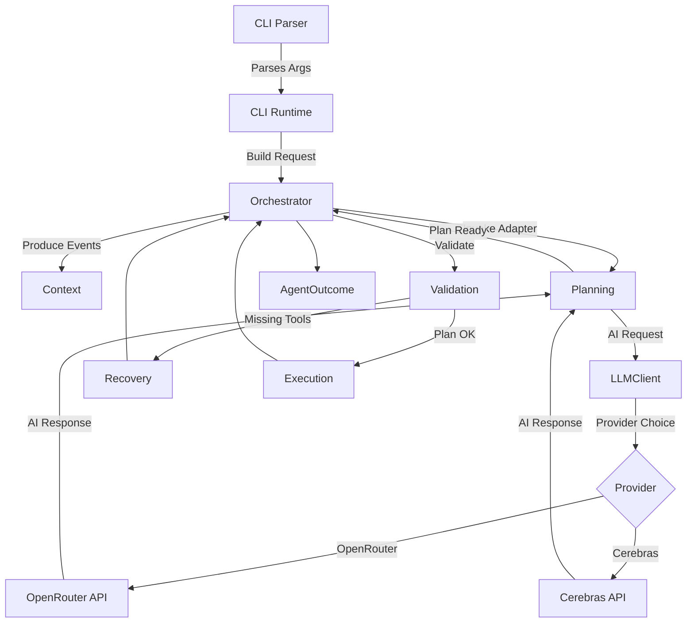
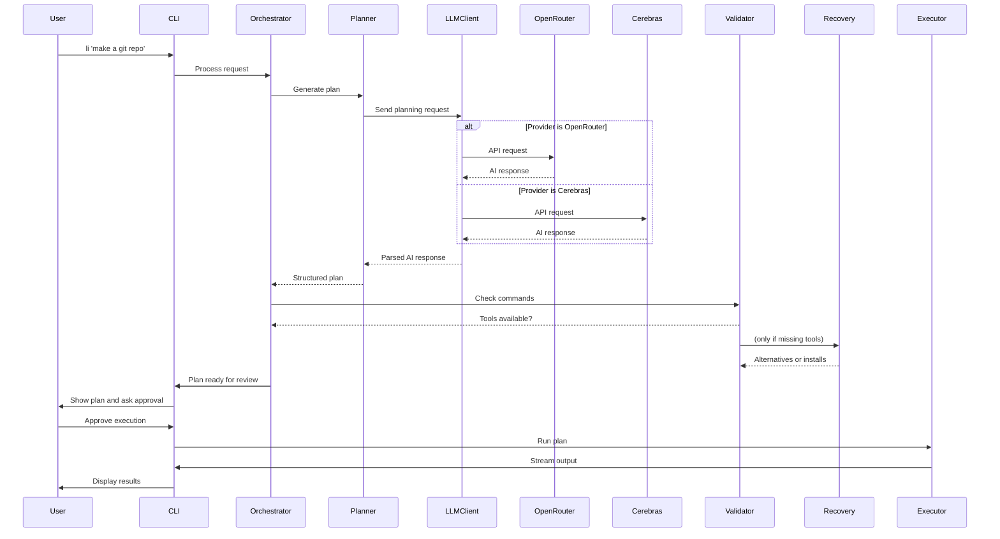
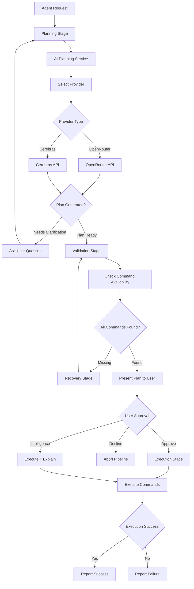

# li CLI Assistant - Architecture Overview

## Table of Contents
1. [Project Overview](#project-overview)
2. [Directory Structure](#directory-structure)
3. [File-by-File Analysis](#file-by-file-analysis)
4. [Architecture Overview](#architecture-overview-1)
5. [Program Flow](#program-flow)
6. [Key Subsystems](#key-subsystems)
7. [Where to Make Modifications](#where-to-make-modifications)
8. [Dependencies and External Libraries](#dependencies-and-external-libraries)

---

## Project Overview

**li** is a lightweight terminal assistant that converts natural language to shell commands. Built in Rust, it provides a safe, minimal command plan generation system that users can review and execute. The application runs on top of the existing shell rather than replacing it, focusing on safety through user approval of all generated plans.

### Key Features
- 🧠 **Natural Language to Commands**: Type plain English, get shell commands
- 🛡️ **Safe Execution**: Every plan is previewed before execution with confidence scoring
- 💬 **Direct AI Chat**: Use `--chat` flag for conversational AI assistance with temperature control
- 🧠 **AI Intelligence Mode**: Use `-i` flag to explain command outputs with question support
- 🌐 **Provider Choice**: Switch between OpenRouter and Cerebras with `li --provider`
- 🔧 **Interactive Setup**: Easy first-time configuration with automatic OpenRouter model fetching
- 📋 **Configuration Management**: Direct configuration via CLI flags with environment variable support
- 🔍 **Enhanced Recovery**: AI-powered alternative command suggestions and installation guidance

### Design Philosophy
- **Safety First**: Never auto-execute without explicit user action
- **User Control**: Users see exactly what will run before it runs
- **Minimal Dependencies**: Zero local AI requirements using hosted providers (OpenRouter, Cerebras)
- **Shell Integration**: Works with existing shell, doesn't replace it

---

## Directory Structure

```
li/
├── src/                          # Main source code directory
│   ├── main.rs                   # Application entry point
│   ├── cli/                      # Command-line interface handling
│   │   ├── mod.rs               # Module exports
│   │   ├── args.rs              # CLI argument definitions
│   │   ├── chat.rs              # Direct chat functionality
│   │   ├── commands.rs          # Main command dispatch logic
│   │   ├── config_cmd.rs        # Configuration command handling
│   │   ├── intelligence.rs      # Intelligence mode for command analysis
│   │   ├── models.rs            # Model selection and management
│   │   ├── providers.rs         # Provider selection logic
│   │   ├── setup.rs             # Interactive setup flows
│   │   ├── task.rs              # Task execution handling
│   │   └── util.rs              # CLI utility functions
│   ├── agent/                    # Core agent orchestration system
│   │   ├── mod.rs               # Module exports and types
│   │   ├── adapters.rs          # Adapter implementations for stages
│   │   ├── context.rs           # Shared execution context
│   │   ├── orchestrator.rs      # Pipeline orchestration
│   │   ├── outcome.rs           # Result types and handling
│   │   ├── stages.rs            # Stage definitions
│   │   ├── types.rs             # Core type definitions
│   │   └── tests.rs             # Agent system tests
│   ├── planner/                  # Command planning logic
│   │   ├── mod.rs               # Module exports and public interface
│   │   ├── parsing.rs           # JSON response parsing utilities
│   │   ├── prompt.rs            # System prompts and templates
│   │   ├── session.rs           # Planning session management
│   │   ├── transport.rs         # HTTP transport for LLM communication
│   │   ├── types.rs             # Plan and related type definitions
│   │   └── tests.rs             # Planner module tests
│   ├── validator/                # Command validation system
│   │   ├── mod.rs               # Validation implementation
│   │   └── tests.rs             # Validation tests
│   ├── exec/                     # Command execution engine
│   │   └── mod.rs               # Execution implementation
│   ├── recovery/                 # Error recovery system
│   │   ├── mod.rs               # Recovery module exports
│   │   ├── ai.rs                # AI-powered recovery generation
│   │   ├── tests.rs             # Recovery module tests
│   │   ├── types.rs             # Recovery type definitions
│   │   ├── ui.rs                # Recovery UI components
│   │   └── utils.rs             # Recovery utility functions
│   ├── client.rs                 # HTTP client for AI services
│   ├── config.rs                 # Configuration management
│   └── tokens.rs                 # Token handling utilities
├── documentation/                # Documentation files
│   ├── architecture-overview.md  # This document
│   ├── prd.md                    # Product requirements document
│   ├── future_plans.md           # Future development plans
│   ├── example-config.json       # Example configuration
│   └── archive/                  # Historical documentation
├── resource/                     # Static resources
│   └── li_logo.png              # Application logo
├── .cursor/                     # IDE-specific configuration
│   └── rules/
│       └── general.md           # General rules
├── Cargo.toml                    # Rust project configuration
├── Cargo.lock                    # Dependency lock file
├── README.md                     # User documentation
└── Various setup/installation files
```

---

## File-by-File Analysis

### Core Entry Points

#### [`src/main.rs`](src/main.rs:1)
The application entry point (38 lines) that:
- Initializes the Tokio async runtime
- Parses CLI arguments using `clap`
- Handles special cases (setup, empty task, welcome message)
- Loads configuration or exits with setup instructions
- Delegates to the CLI commands module for actual execution

**Key responsibilities**: Bootstrap, configuration loading, error handling

#### [`src/cli/mod.rs`](src/cli/mod.rs:1)
Simple module export file (10 lines) that re-exports the CLI argument structure and submodules.

#### [`src/cli/args.rs`](src/cli/args.rs:1)
Defines the CLI argument structure using `clap` derive macros (79 lines) that:
- Declares all CLI commands, flags, and options
- Handles the main command structure with optional subcommands
- Defines the `Cli` struct with all possible arguments
- Implements entry points for setup and run operations

**Key responsibilities**: CLI argument parsing, structure definition

#### [`src/cli/commands.rs`](src/cli/commands.rs:1)
The heart of the CLI system (345 lines) that:
- Dispatches commands to appropriate handlers based on parsed arguments
- Handles provider and model overrides
- Manages configuration updates via command-line flags
- Coordinates between CLI components and the core agent system
- Displays the welcome message for empty invocations

**Key responsibilities**: Command routing, orchestration, configuration management

#### Other CLI Modules

The CLI system has been refactored into focused modules for better maintainability:

- **[`src/cli/setup.rs`](src/cli/setup.rs:1)**: Interactive setup wizard for first-time configuration
- **[`src/cli/chat.rs`](src/cli/chat.rs:1)**: Direct chat functionality with configurable parameters
- **[`src/cli/intelligence.rs`](src/cli/intelligence.rs:1)**: Intelligence mode for explaining command outputs
- **[`src/cli/config_cmd.rs`](src/cli/config_cmd.rs:1)**: Configuration management via command-line flags
- **[`src/cli/models.rs`](src/cli/models.rs:1)**: Model selection and management utilities
- **[`src/cli/providers.rs`](src/cli/providers.rs:1)**: Provider selection and configuration
- **[`src/cli/task.rs`](src/cli/task.rs:1)**: Task execution handling using the agent system
- **[`src/cli/util.rs`](src/cli/util.rs:1)**: Utility functions for CLI operations

### Core Agent System

#### [`src/agent/mod.rs`](src/agent/mod.rs:1)
Central module that exports all agent components:
- Adapters for different pipeline stages
- Context and request handling
- Orchestrator and outcome types
- Stage definitions and execution

#### [`src/agent/orchestrator.rs`](src/agent/orchestrator.rs:1)
Pipeline orchestration system that:
- Manages the sequence of processing stages
- Provides a builder pattern for stage configuration
- Handles stage execution and error propagation
- Maintains execution context across stages

**Key responsibilities**: Pipeline management, stage coordination

#### [`src/agent/adapters.rs`](src/agent/adapters.rs:1)
Implementation of pipeline stage adapters:
- `DirectPlanningAdapter`: Manages command planning with AI integration
- `CommandValidationAdapter`: Validates planned commands using system checks
- `PlanExecutionAdapter`: Executes approved plans with streaming output
- Various noop adapters for testing and configuration

#### [`src/agent/context.rs`](src/agent/context.rs:1)
Shared execution context that tracks:
- Original agent request and configuration
- Generated plans and validation results
- Execution reports and recovery outcomes
- Event logging and timing information

#### [`src/agent/stages.rs`](src/agent/stages.rs:1)
Stage definitions for the processing pipeline:
- `PlanningStage`: Generates command plans with AI assistance
- `ValidationStage`: Checks command availability on the system
- `ExecutionStage`: Runs approved commands with real-time output
- `RecoveryStage`: Handles missing tools/errors with intelligent suggestions

### AI Service Integration

#### [`src/planner/mod.rs`](src/planner/mod.rs:1)
Planner module that exports the public interface for command planning (28 lines).

The planner functionality has been refactored into focused modules:

- **[`src/planner/session.rs`](src/planner/session.rs:1)**: Planning session management with interactive resolution
- **[`src/planner/prompt.rs`](src/planner/prompt.rs:1)**: System prompts and templates for LLM interactions
- **[`src/planner/transport.rs`](src/planner/transport.rs:1)**: HTTP transport layer for LLM communication
- **[`src/planner/parsing.rs`](src/planner/parsing.rs:1)**: Robust JSON response parsing utilities
- **[`src/planner/types.rs`](src/planner/types.rs:1)**: Plan and related type definitions
- **[`src/planner/tests.rs`](src/planner/tests.rs:1)**: Comprehensive planner module tests

The overall planner system:
- Converts natural language into safe shell command sequences
- Supports interactive clarification when needed
- Handles AI model responses with robust JSON parsing
- Includes safety checks and confidence scoring

**Key responsibilities**: Command generation, safety validation, user interaction

#### [`src/client.rs`](src/client.rs:1)
HTTP client for AI services that:
- Implements the `LlmClient` trait for different providers
- Handles OpenRouter and Cerebras API interactions
- Manages authentication, timeouts, and error handling
- Provides factory methods for client creation

### System Integration

#### [`src/exec/mod.rs`](src/exec/mod.rs:1)
Command execution engine that:
- Executes shell commands with proper environment setup
- Streams output in real-time with visual formatting
- Captures output for intelligence mode analysis
- Handles color output and terminal integration

#### [`src/validator/mod.rs`](src/validator/mod.rs:1)
Command validation system that:
- Checks if planned commands exist on the system
- Maintains a cache of validated commands
- Handles complex command parsing (pipes, redirects, etc.)
- Provides detailed missing command information

#### [`src/recovery/mod.rs`](src/recovery/mod.rs:1)
Recovery module that exports the error recovery system (33 lines).

The recovery functionality has been refactored into focused modules:

- **[`src/recovery/ai.rs`](src/recovery/ai.rs:1)**: AI-powered recovery option generation
- **[`src/recovery/ui.rs`](src/recovery/ui.rs:1)**: Interactive recovery UI components and menus
- **[`src/recovery/types.rs`](src/recovery/types.rs:1)**: Recovery type definitions and result enums
- **[`src/recovery/utils.rs`](src/recovery/utils.rs:1)**: Recovery utility functions and helpers
- **[`src/recovery/tests.rs`](src/recovery/tests.rs:1)**: Recovery module tests

The overall recovery system:
- Generates alternative commands when tools are missing
- Provides installation instructions for missing dependencies
- Offers interactive recovery menus
- Supports multiple recovery strategies (alternatives first, installation first)

### Configuration & Utilities

#### [`src/config.rs`](src/config.rs:1)
Configuration management (702 lines) that:
- Handles multiple configuration formats (legacy and nested)
- Provides environment variable overrides for all settings
- Manages model settings, API keys, and preferences
- Includes comprehensive validation and defaults
- Features extensive test coverage for configuration loading

#### [`src/tokens.rs`](src/tokens.rs:1)
Token handling utilities (49 lines) for:
- Calculating token budgets for AI requests
- Managing context window limits
- Optimizing API usage with conservative estimates

---

## Architecture Overview

### System Architecture Diagram



### Data Flow Diagram


### Component Interaction Diagram



---

## Program Flow

### Startup Flow


### Main Processing Pipeline



---

## Key Subsystems

### 1. CLI Subsystem

**Location**: [`src/cli/`](src/cli/) (modular directory structure)

**Purpose**: Handles all user-facing command-line interactions, argument parsing, and user experience flows through a modular architecture.

**Key Components**:
- **CLI Parser**: Defined in [`args.rs`](src/cli/args.rs:1) using `clap` derive macros for comprehensive argument handling
- **Command Dispatcher**: Located in [`commands.rs`](src/cli/commands.rs:1) for routing to appropriate handlers
- **Setup Flow**: Interactive configuration wizard in [`setup.rs`](src/cli/setup.rs:1) with OpenRouter model fetching
- **Model Selection**: Dynamic model fetching with interactive selection in [`models.rs`](src/cli/models.rs:1)
- **Provider Selection**: Interactive switching between OpenRouter and Cerebras in [`providers.rs`](src/cli/providers.rs:1)
- **Intelligence Mode**: Enhanced command output explanation in [`intelligence.rs`](src/cli/intelligence.rs:1)
- **Direct Chat**: Bypass planning for direct AI conversation in [`chat.rs`](src/cli/chat.rs:1)
- **Configuration Management**: Direct configuration via CLI flags in [`config_cmd.rs`](src/cli/config_cmd.rs:1)
- **Task Execution**: Main task handling in [`task.rs`](src/cli/task.rs:1) using the agent system
- **CLI Utilities**: Shared utility functions in [`util.rs`](src/cli/util.rs:1)

**Key Functions**:
- [`commands::run()`](src/cli/commands.rs:1): Main execution dispatcher with comprehensive argument routing
- [`setup::run_setup()`](src/cli/setup.rs:1): Interactive configuration with provider-specific setup
- [`chat::handle_chat_direct()`](src/cli/chat.rs:1): Direct AI conversation with configurable parameters
- [`intelligence::handle_intelligence()`](src/cli/intelligence.rs:1): Enhanced command output analysis with question support
- [`config_cmd::handle_config_direct()`](src/cli/config_cmd.rs:1): Direct configuration management via flags
- [`task::handle_task()`](src/cli/task.rs:1): Main task execution using the agent system

### 2. Agent Subsystem

**Location**: [`src/agent/`](src/agent/)

**Purpose**: Provides a modular, pipeline-based architecture for processing user requests through multiple stages.

**Key Components**:
- **Orchestrator**: Pipeline management and stage coordination
- **Adapters**: Implementations for each processing stage
- **Context**: Shared state and execution tracking
- **Stages**: Sequential processing steps (plan → validate → execute → recover)
- **Outcomes**: Rich result types for different execution paths

**Key Functions**:
- [`AgentOrchestrator::run()`](src/agent/orchestrator.rs:33): Execute pipeline
- [`AgentPipelineBuilder`](src/agent/orchestrator.rs:60): Configure processing stages
- [`AgentContext`](src/agent/context.rs:1): Manage shared execution state

### 3. Planner Subsystem

**Location**: [`src/planner/`](src/planner/) (modular directory structure)

**Purpose**: Converts natural language requests into safe, minimal shell command sequences through a focused module architecture.

**Key Components**:
- **Planning Engine**: AI-powered command generation in [`session.rs`](src/planner/session.rs:1)
- **Interactive Resolver**: Handles clarification questions in [`session.rs`](src/planner/session.rs:1)
- **JSON Extractor**: Robust parsing of AI responses in [`parsing.rs`](src/planner/parsing.rs:1)
- **Transport Layer**: HTTP communication for AI requests in [`transport.rs`](src/planner/transport.rs:1)
- **System Prompts**: LLM prompts and templates in [`prompt.rs`](src/planner/prompt.rs:1)
- **Type Definitions**: Plan and related types in [`types.rs`](src/planner/types.rs:1)

**Key Functions**:
- [`plan()`](src/planner/mod.rs:1): Main planning function interface
- [`session::interactive_plan_with_resolver()`](src/planner/session.rs:1): Interactive planning with questions
- [`parsing::extract_json_object()`](src/planner/parsing.rs:1): Parse AI responses
- [`transport::send_planning_request()`](src/planner/transport.rs:1): Send requests to AI providers

**Safety Features**:
- Prefers dry-run commands first
- Avoids destructive operations
- Requires user approval for execution
- Confidence scoring for plans

### 4. Validator Subsystem

**Location**: [`src/validator/mod.rs`](src/validator/mod.rs:1)

**Purpose**: Checks if all commands in a generated plan are available on the user's system.

**Key Components**:
- **Command Validator**: Checks command existence
- **Command Extractor**: Parses complex command lines
- **Cache System**: Improves performance with caching
- **Available Tools**: Lists common system utilities

**Key Functions**:
- [`validate_plan()`](src/validator/mod.rs:132): Validate entire plan
- [`command_exists()`](src/validator/mod.rs:73): Check single command
- [`extract_command()`](src/validator/mod.rs:34): Parse command from line

**Validation Strategy**:
- Uses `command -v` for system commands
- Checks file existence and permissions for paths
- Maintains cache for repeated checks
- Provides detailed missing command information

### 5. Executor Subsystem

**Location**: [`src/exec/mod.rs`](src/exec/mod.rs:1)

**Purpose**: Executes approved command plans with proper output formatting and error handling.

**Key Components**:
- **Plan Executor**: Executes command sequences
- **Output Streamer**: Real-time output display
- **Error Handler**: Manages command failures
- **Capture Mode**: Captures output for analysis

**Key Functions**:
- [`execute_plan()`](src/exec/mod.rs:8): Execute with streaming
- [`execute_plan_with_capture()`](src/exec/mod.rs:49): Execute and capture
- [`run_command()`](src/exec/mod.rs:183): Execute single command

**Execution Features**:
- Phase execution (dry-run → execute)
- Real-time output streaming
- Color preservation
- Error propagation
- Success/failure reporting

### 6. Recovery Subsystem

**Location**: [`src/recovery/`](src/recovery/) (modular directory structure)

**Purpose**: Provides intelligent recovery options when commands are missing or unavailable through a focused module architecture.

**Key Components**:
- **Recovery Engine**: Main recovery coordination in [`mod.rs`](src/recovery/mod.rs:1)
- **AI Generator**: AI-powered recovery option generation in [`ai.rs`](src/recovery/ai.rs:1)
- **Installation Provider**: Offers installation instructions in [`utils.rs`](src/recovery/utils.rs:1)
- **Interactive Menu**: User-friendly recovery interface in [`ui.rs`](src/recovery/ui.rs:1)
- **Type Definitions**: Recovery types and results in [`types.rs`](src/recovery/types.rs:1)

**Key Functions**:
- [`generate_recovery_options()`](src/recovery/mod.rs:1): Create recovery options
- [`ai::generate_recovery_with_ai()`](src/recovery/ai.rs:1): AI-powered recovery generation
- [`ui::present_recovery_menu()`](src/recovery/ui.rs:1): Interactive recovery UI
- [`execute_recovery()`](src/recovery/mod.rs:1): Execute user's recovery choice

**Recovery Strategies**:
- **Alternatives First**: Suggest alternative commands first
- **Installation First**: Prioritize installation instructions
- **Skip Only**: Only allow skipping failed steps
- **Never Recover**: Disable recovery entirely

### 7. Configuration & Token Management

**Location**: [`src/config.rs`](src/config.rs:1), [`src/tokens.rs`](src/tokens.rs:1)

**Purpose**: Manages all aspects of application configuration, settings, and token optimization.

**Key Components**:
- **Config Builder**: Fluent configuration API with comprehensive validation
- **Settings Management**: LLM, model, recovery, and timeout settings
- **Persistence**: Load/save configuration files with legacy and nested format support
- **Environment Overrides**: `OPENROUTER_API_KEY`, `CEREBRAS_API_KEY`, `LI_PROVIDER`, `LI_LLM_BASE_URL`, `LI_TIMEOUT_SECS`, `LI_MAX_TOKENS`, `LI_PLANNER_MODEL`
- **Token Management**: Conservative token budgeting and context window optimization

**Key Functions**:
- [`Config::load()`](src/config.rs:38): Load configuration with environment overrides
- [`Config::save()`](src/config.rs:53): Persist settings to disk with validation
- [`ConfigBuilder`](src/config.rs:245): Fluent configuration API
- [`compute_completion_token_budget()`](src/tokens.rs:34): Calculate optimal token allocation

---

## Where to Make Modifications

### 1. Adding New AI Models

**Files to modify**:
- [`src/config.rs`](src/config.rs:1) - Add new model defaults
- [`src/cli/models.rs`](src/cli/models.rs:1) - Update model selection UI
- [`src/client.rs`](src/client.rs:1) - Add model-specific handling

**Example**: Adding a new provider
```rust
// In src/config.rs
#[derive(Debug, Clone, Copy, PartialEq, Eq, Serialize, Deserialize)]
#[serde(rename_all = "kebab-case")]
pub enum LlmProvider {
    OpenRouter,
    NewProvider,  // Add new provider
}
```

### 2. Extending Command Planning

**Files to modify**:
- [`src/planner/prompt.rs`](src/planner/prompt.rs:1) - Update system prompt
- [`src/planner/types.rs`](src/planner/types.rs:1) - Update JSON schema
- [`src/cli/task.rs`](src/cli/task.rs:1) - Adjust plan rendering/approval flow

**Example**: Adding new safety heuristics
```rust
// In src/planner/mod.rs
#[derive(Debug, Deserialize)]
#[serde(tag = "type", rename_all = "lowercase")]
enum PlannerResponse {
    Plan {
        confidence: f32,
        dry_run_commands: Vec<String>,
        execute_commands: Vec<String>,
        notes: String,
        safety_warnings: Vec<String>, // New field
    },
    Question {
        text: String,
        context: String,
    },
}
```

### 3. Adding New Safety Rules

**Files to modify**:
- [`src/planner/prompt.rs`](src/planner/prompt.rs:1) - Update system prompt
- [`src/planner/types.rs`](src/planner/types.rs:1) - Expand JSON schema

**Example**: Adding execution context
```rust
#[derive(Debug, Deserialize)]
#[serde(tag = "type", rename_all = "lowercase")]
enum PlannerResponse {
    Plan {
        confidence: f32,
        dry_run_commands: Vec<String>,
        execute_commands: Vec<String>,
        notes: String,
        execution_context: String,  // New field
    },
    // ... existing variants
}
```

### 4. Expanding Recovery Options

**Files to modify**:
- [`src/recovery/types.rs`](src/recovery/types.rs:1) - Add new recovery types
- [`src/recovery/ai.rs`](src/recovery/ai.rs:1) - Implement new recovery generation logic
- [`src/config.rs`](src/config.rs:1) - Update configuration options

**Example**: Adding auto-recovery
```rust
#[derive(Debug, Clone, Copy, PartialEq, Eq, Serialize, Deserialize)]
#[serde(rename_all = "kebab-case")]
pub enum RecoveryPreference {
    AlternativesFirst,
    InstallationFirst,
    SkipOnError,
    NeverRecover,
    AutoRecover,  // New automatic recovery option
}
```

### 5. Adding New CLI Commands

**Files to modify**:
- [`src/cli/args.rs`](src/cli/args.rs:1) - Add new enum variants to `Command`
- [`src/cli/commands.rs`](src/cli/commands.rs:1) - Add new routing logic
- Create new modules in `src/cli/` for command implementation

**Example**: Adding a "history" command
```rust
#[derive(Debug, Subcommand)]
pub enum Command {
    Chat(ChatArgs),
    History(HistoryArgs),  // New command
}

// Add handler
async fn handle_history(args: HistoryArgs, config: &Config) -> Result<()> {
    // Implementation
}
```

### 6. Modifying Output Formatting

**Files to modify**:
- [`src/exec/mod.rs`](src/exec/mod.rs:1) - Update output streaming
- [`src/cli/task.rs`](src/cli/task.rs:1) - Modify plan display
- [`src/recovery/ui.rs`](src/recovery/ui.rs:1) - Update recovery UI
- [`src/cli/util.rs`](src/cli/util.rs:1) - Modify shared output utilities

### 7. Adding New Validation Checks

**Files to modify**:
- [`src/validator/mod.rs`](src/validator/mod.rs:1) - Add new validation logic
- [`src/validator/mod.rs`](src/validator/mod.rs:12) - Expand validation result types

### 8. Validation & Recovery Enhancements

**Files to modify**:
- [`src/validator/mod.rs`](src/validator/mod.rs:1) - Adjust validation heuristics
- [`src/recovery/mod.rs`](src/recovery/mod.rs:1) - Update recovery strategies

**Example**: Adding automated retries
```rust
// In src/recovery/mod.rs
pub enum RecoveryResult {
    AlternativeSucceeded(CommandAlternative),
    InstallationSucceeded(InstallationInstruction),
    RetryScheduled { delay_secs: u64 }, // New variant
    // ...existing variants
}
```

---

## Dependencies and External Libraries

### Core Dependencies

#### [`Cargo.toml`](Cargo.toml:10) Main Dependencies

- **`anyhow = "1.0"`**: Error handling and context
  - Used throughout for ergonomic error handling with context propagation
  - Provides chainable errors and debugging information

- **`clap = { version = "4.5", features = ["derive"] }`**: CLI argument parsing
  - Powers all command-line interface functionality with subcommands
  - Provides derive macros for automatic parsing and help generation

- **`tokio = { version = "1.40", features = ["full"] }`**: Async runtime
  - Enables asynchronous command execution and HTTP requests
  - Provides task spawning, I/O handling, and async process management

- **`reqwest = { version = "0.12", features = ["json"] }`**: HTTP client
  - Handles LLM provider API communication (OpenRouter, Cerebras)
  - Provides JSON serialization/deserialization and retry logic

- **`serde = { version = "1.0", features = ["derive"] }`**: Serialization
  - Powers configuration file handling with legacy and nested format support
  - Enables AI response parsing and configuration persistence

- **`serde_json = "1.0"`**: JSON handling
  - Parses AI model responses with robust error handling
  - Manages configuration persistence and API communication

### Utility Dependencies

- **`colored = "2.1"`**: Terminal color output
  - Used in recovery system for enhanced user experience
  - Provides colored text output with formatting options

- **`dirs = "5.0"`**: Directory handling
  - Finds user home directory for configuration storage
  - Provides cross-platform directory resolution

- **`async-trait = "0.1"`**: Async trait support
  - Enables async methods in trait implementations for LLM clients
  - Used in client abstraction layer and testing

### Development Dependencies

- **`tempfile = "3.12"`**: Temporary file handling
  - Used in tests for configuration testing and temporary environments
  - Provides isolated test environments for configuration management

- **`httpmock = "0.7"`**: HTTP mocking
  - Enables comprehensive API testing for LLM provider integrations
  - Provides mock HTTP servers for testing client functionality

### External Services

#### LLM Provider APIs
- **Supported Providers**:
  - **OpenRouter**
    - **Base URL**: `https://openrouter.ai/api/v1`
    - **Purpose**: Aggregated AI model hosting and inference
    - **Authentication**: Bearer token (API key)
    - **Model Selection**: CLI can fetch free models for interactive selection
  - **Cerebras**
    - **Base URL**: `https://api.cerebras.ai/v1`
    - **Purpose**: Cerebras Inference endpoint for hosted models
    - **Authentication**: Bearer token (API key)
    - **Model Selection**: User-provided model IDs (no remote listing yet)

#### File System Integration
- **Configuration Location**: `~/.li/config`
- **Log Directory**: `LI_LOG_DIR` environment variable

### Key Design Patterns

#### Trait-Based Architecture
```rust
// From src/client.rs
pub trait LlmClient: Send + Sync {
    async fn chat_completion(&self, request: ChatCompletionRequest) -> Result<ChatCompletionResponse>;
}
```

#### Builder Pattern
```rust
// From src/config.rs
let config = Config::builder()
    .with_llm(|llm| llm.api_key = "key".to_string())
    .with_models(|models| models.max_tokens = 4096)
    .build()?;
```

#### Adapter Pattern
```rust
// From src/agent/adapters.rs
pub struct DirectPlanningAdapter {
    factory: Arc<dyn LlmClientFactory>,
}
```

#### Result Type Pattern
```rust
// From src/agent/outcome.rs
pub enum AgentOutcome {
    Planned { plan: Option<Plan>, validation: Option<ValidationResult>, ... },
    AwaitingClarification { question: String, context: String },
    Cancelled { reason: String },
    Failed { stage: StageKind, error: String },
}
```

---

## Conclusion

The li CLI assistant represents a sophisticated, modular architecture designed for safety, extensibility, and user experience. Following a recent refactor, the system now features enhanced modularity with focused components and clear separation of concerns through a pipeline-based architecture.

Key architectural strengths:
- **Enhanced Modular Design**: CLI, planner, and recovery systems have been refactored into focused modules for better maintainability
- **Pipeline-Based Architecture**: Clear separation between CLI, agent, planning, validation, execution, and recovery layers
- **Safety-First Approach**: Multiple validation stages and user approval requirements with confidence scoring
- **Extensible Pipeline**: Adapter-based system allows easy addition of new processing stages
- **Robust Error Handling**: Comprehensive recovery system with AI-powered suggestions
- **Configuration Flexibility**: Multiple configuration sources with comprehensive environment variable support
- **Pluggable Providers**: Easy to swap hosted LLMs without changing the core pipeline
- **Enhanced User Experience**: Interactive setup, intelligence mode, and modular command handling

Recent Improvements:
- **CLI Module Refactoring**: Monolithic runtime.rs replaced with focused modules (args.rs, commands.rs, task.rs, etc.)
- **Planner Decomposition**: Single planning module split into session, prompt, transport, parsing, and types modules
- **Recovery Enhancement**: Recovery system organized into specialized modules for AI generation, UI, types, and utilities

The architecture is well-positioned for future enhancements including additional AI providers and extended command capabilities while maintaining backward compatibility and user safety.

**Current Version**: 0.1.1 (as of Cargo.toml)

---

*This document serves as a comprehensive guide for developers working with the li CLI assistant codebase. For specific implementation details, refer to the inline documentation and test cases within each module.*