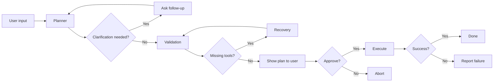

# li — Product Requirements Document (PRD)

## 1) Overview

**li** is a lightweight terminal assistant that lets users type plain English (e.g., “make a new git repo”) and get safe, minimal shell command plans. Users review the plan and approve execution. It runs **on top of the existing shell** rather than replacing it.

### Objectives

* Remove most of the need to recall exact shell commands.
* Keep users in control: every action is previewed as a plan and only runs on approval.
* Zero local AI requirements: use **OpenRouter-hosted models**.

### Non-Goals (v1)

* No code generation or multi-file scaffolding.
* No telemetry or analytics.
* No local model support.
* No Windows support (macOS/Linux only to start).

---

## 2) Target Users & Core Jobs

* **Dev who forgets flags**: “Initialize a new git repo and connect to GitHub.”
* **Ops tasks**: “List top 20 largest files in this folder and show sizes human readable.”
* **Project hygiene**: “Create a .gitignore for Rust and commit everything.”

Success looks like: users trust the plan preview, approve confidently, and rarely need to retype commands.

---

## 3) User Stories (v1)

1. As a developer, I can run `li "make a new git repo"` and see a **plan** with commands before anything runs.
2. As a developer, I can hit **enter** (or `y`) to execute the plan, or **n** to cancel.
3. As a developer, I can pass `--yes` to auto-execute without a confirm prompt (explicit opt-in).
4. As a developer, I can configure providers/models so planning uses the tools I prefer.
5. As a developer, I can see safe **dry-run** probes (where applicable) before destructive commands.

---

## 4) Functional Requirements

### 4.1 CLI

* **Binary**: `li`
* **Usage**:

  * `li "plain english task"` → plan → show plan → prompt to execute.
  * `li --setup` → interactive first-time configuration (provider, API key, planner model, timeout)
  * `li --provider` → list or interactively choose supported providers
  * `li --model` → fetch and select free OpenRouter models; accepts `list` or `interactive`
  * `li --version`, `li --help`.
* **Flags**:

  * `--yes` / `-y` : auto-approve execution.
  * `--model qwen-235b` : override planner (debug only; default locked to 235B).
  * `--no-color` : disable colors in TUI output.

### 4.2 Plan Executor

*Purpose*: Transform natural-language tasks into safe shell plans, validate prerequisites, present the plan to the user, and execute upon approval.

**Responsibilities**
- Convert goals into JSON plans (dry-run + execute commands, confidence, notes)
- Ask clarifying questions when essential information is missing
- Validate required tools and offer recovery flows when possible
- Present the plan to the user for approval before execution

### 4.3 Planner

* Model: **MiniMax M2** on OpenRouter.
* Returns strict JSON (schema below).
* Emits **safe, minimal** command steps; prefers idempotent operations and `--dry-run`/`--check` flags when available.
* Must never run commands by itself; **li** executes only after user approval.

### 4.4 Execution

* Display `dry_run_commands` first (if present).
* On approval, execute `execute_commands` sequentially and stream stdout/stderr.
* Stop on first non-zero exit unless `--continue-on-error` (not in v1).
* Return overall exit code.

---

## 5) Non-Functional Requirements

* **Safety**: Never auto-execute without explicit user action (or `--yes`).
* **Performance**: Plan generation under 3–6s typical (depends on OpenRouter latency).
* **Reliability**: Graceful timeouts and clear error messages; retry planner once on malformed JSON.
* **Privacy**: No telemetry. No local logs unless user opts in with `LI_LOG_DIR`.

---

## 6) System Architecture



---

## 7) Model Policy (v1)

* **Planner**: **Qwen3-235B (thinking)**, strict JSON schema, safety guidelines in prompt (prefer dry-run/idempotent; never destructive without prior check).
* **Recovery Agent**: Lightweight instructions to suggest tool installation or safe alternatives when validation fails.
* **No codegen**: If the task actually requires code, planner should answer with a plan that **exits early** and suggests a follow-up (“This requires code; not supported in v1.”).

---

## 8) Prompts & Schemas

### 8.1 Planner Safety Guardrails

The planner prompt enforces:
- Idempotent dry-run commands before mutations
- Explicit JSON schema compliance (no additional keys, no prose)
- Notes field to capture assumptions, portability warnings, or unsupported tasks

---

### 8.2 Planner — System Prompt (v1)

> You convert plain English into a **safe, minimal shell plan**.
> Follow these rules:
>
> 1. Prefer `dry_run_commands` and idempotent checks first.
> 2. Avoid destructive operations unless preceded by a safety probe.
> 3. Keep commands portable for macOS/Linux where possible.
> 4. Output **only** valid JSON matching the provided schema—no extra fields, no comments, no prose.
> 5. If the task requires coding or multi-file scaffolding, set `notes` to explain that v1 doesn’t support code generation and produce a minimal plan that stops safely.

**Context provided each call**

* `cwd`: {cwd}
* `os`: {os}
* `available_tools`: git, brew, docker
* `constraints`: ask for approval before execution; prefer `--dry-run` / checks

**Schema**

```json
{
  "type": "object",
  "required": ["type","confidence","dry_run_commands","execute_commands","notes"],
  "properties": {
    "type": { "const": "plan" },
    "confidence": { "type": "number", "minimum": 0, "maximum": 1 },
    "dry_run_commands": { "type": "array", "items": { "type": "string" } },
    "execute_commands": { "type": "array", "items": { "type": "string" } },
    "notes": { "type": "string" }
  },
  "additionalProperties": false
}
```

**User content example**

```
{natural_language_request}
```

**Output example**

```json
{
  "type": "plan",
  "confidence": 0.82,
  "dry_run_commands": ["git status"],
  "execute_commands": ["git init", "git add .", "git commit -m \"Initial commit\""],
  "notes": "Created minimal git repo with initial commit."
}
```

---

## 9) CLI UX Spec

### 9.1 Baseline flow

```
$ li "make a new git repo"
Plan (approve? y/N):
  Dry-run:
    • git status
  Will execute:
    1. git init
    2. git add .
    3. git commit -m "Initial commit"
[y/N]:
```

---

### 9.2 CLI Flags & UX Notes

```
$ li "make a new git repo"
Plan (approve? y/N):
  Dry-run:
    • git status
  Will execute:
    1. git init
    2. git add .
    3. git commit -m "Initial commit"
[y/N]:
```

- `--yes` auto-approves plan execution.
- `--provider` lets users switch between OpenRouter and Cerebras.
- `--model` (OpenRouter only) fetches free models for interactive selection.
- `--verbose` streams raw LLM requests/responses for debugging.

---

## 10) Security & Safety

* No automatic execution by default.
* Clear preview with exact commands to run.
* Destructive commands require preceding checks in `dry_run_commands` when possible.
* Network calls limited to OpenRouter API; redact cwd/user path if surfaced in prompts (keep minimal context).

---

## 11) Configuration

* `OPENROUTER_API_KEY` (required).
* `LI_TIMEOUT_SECS` (default 30).
* `LI_MAX_TOKENS` (planner output cap; default reasonable).
* `LI_LOG_DIR` (unset by default; if set, write JSONL of plans and results locally).

---

## 12) Packaging & Distribution (Homebrew)

### 12.1 Release process

1. Build static binaries for macOS (arm64, x86_64) and Linux (x86_64).
2. Upload to GitHub Releases with checksums.
3. Maintain a Homebrew **tap** (e.g., `brew tap yourorg/li`).

### 12.2 Example Formula (sketch)

```ruby
class Li < Formula
  desc "Plain-English to shell assistant"
  homepage "https://github.com/yourorg/li"
  version "0.1.0"
  if Hardware::CPU.arm?
    url "https://github.com/yourorg/li/releases/download/v0.1.0/li-macos-arm64.tar.gz"
    sha256 "<sha256>"
  else
    url "https://github.com/yourorg/li/releases/download/v0.1.0/li-macos-x86_64.tar.gz"
    sha256 "<sha256>"
  end
  def install
    bin.install "li"
  end
  test do
    assert_match "li", shell_output("#{bin}/li --help")
  end
end
```

### 12.3 User install

```
brew tap yourorg/li
brew install li
```

---

## 13) Rust Architecture

### 13.1 Crates

* `clap` (CLI)
* `reqwest` + `tokio` (HTTP async)
* `serde` / `serde_json` (strict JSON)
* `regex` (guardrails if needed)
* `ratatui` (nice TUI plan preview; optional)
* `which` (detect tools)
* `parking_lot` (if needed for sync)

### 13.2 Module layout

```
src/
  main.rs
  cli/
    mod.rs
    runtime.rs
  agent/
    mod.rs
    adapters.rs
    context.rs
    orchestrator.rs
    outcome.rs
    stages.rs
    types.rs
  client.rs
  config.rs
  exec/
    mod.rs
  planner/
    mod.rs
  recovery/
    mod.rs
  tokens.rs
  validator/
    mod.rs
```

---

## 14) Error Handling

* **Planner malformed JSON** → one retry; on failure, show message “Couldn’t create a safe plan.”
* **Validation failure** → stop and show missing tools (optionally prompt for recovery if enabled).
* **Execution failure** → stop on first non-zero; show offending command and exit code.

---

## 15) Testing & Acceptance

### 15.1 Unit

* Planner: validate against schema; reject additional properties.
* Recovery: ensure menu options render correctly and commands are validated.

### 15.2 Integration

* “Make a new git repo” → expected dry-run + execute list.
* “List big files” → uses `du`/`ls` correctly across macOS/Linux.

### 15.3 Manual

* Network outage → friendly error.
* `--yes` actually executes without prompt.
* Commands execute in correct `cwd`.

**Acceptance Criteria (v1)**

* End-to-end: `li "make a new git repo"` produces a valid plan and executes after approval on macOS and Linux.
* Homebrew install works from a clean machine.
* No telemetry emitted by default.

---

## 16) Roadmap

### v1.0 (this PRD)

* Plan → Approve → Execute
* OpenRouter MiniMax M2 planner
* Homebrew packaging

### v1.1

* Better portability shims (e.g., BSD vs GNU utilities)
* Enhanced validation heuristics

### v2.0 (post-MVP ideas)

* Add **Qwen3-480B (coder)** behind a gate for codegen tasks.
* Quick **recipes/plugins** (git, docker, brew, aws).
* Local model fallback.
* Rich diffs (e.g., `git` previews, file change summaries).
* Future enhancements:
  * Provider selection extensions (Azure OpenAI, Anthropic)
  * Offline cache of popular command templates
